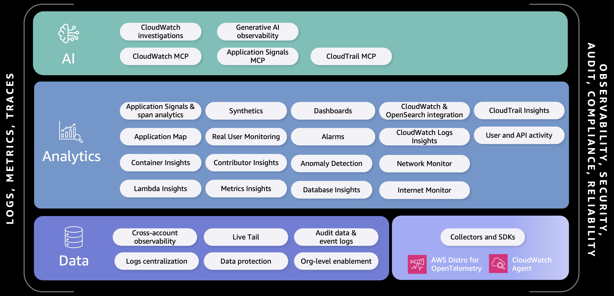

# Introduction to AWS Observability

**AWS provides native monitoring, logging, alarming, and dashboards** with [Amazon CloudWatch](https://aws.amazon.com/cloudwatch/), delivering the three pillars of observability (Metrics, Logs & Traces) with AI-powered insights. CloudWatch provides native OpenTelemetry support through OTLP endpoints for standardized telemetry collection.

[Amazon CloudWatch Application Signals](https://aws.amazon.com/cloudwatch/features/application-observability-apm/)  offers automatic instrumentation and complete visibility into application transactions, with pre-built dashboards, service maps, and interactive transaction search across 100% of spans.

[Amazon CloudWatch Investigations](https://docs.aws.amazon.com/AmazonCloudWatch/latest/monitoring/Investigations.html) provides AI-powered root cause analysis by automatically correlating metrics, logs, traces, and alarms.

Amazon CloudWatch Generative AI Observability  enables monitoring of generative AI workloads with pre-configured views for latency,usage, and errors. End-to-end prompt tracing identifies issues in knowledge bases, tools, and models across frameworks like AWS Strands, LangChain, and LangGraph.

AWS also offers [Amazon Managed Service for Prometheus](https://aws.amazon.com/prometheus/), [Amazon Managed Grafana](https://aws.amazon.com/grafana/), and [Amazon OpenSearch Service](https://aws.amazon.com/opensearch-service/) for customers preferring open-source based solutions.

For application instrumentation using open standards, [AWS Distro for OpenTelemetry (ADOT)](https://aws-otel.github.io/) provides a secure, production-ready distribution of the OpenTelemetry project. As part of the Cloud Native Computing Foundation, OpenTelemetry offers vendor-neutral APIs, libraries, and agents for collecting distributed traces and metrics. With ADOT, you can instrument your applications once and send telemetry to CloudWatch, Amazon OpenSearch Service, or any OpenTelemetry-compatible backend.

## AWS Observability options

## AWS Observability innovations

[Ops in the AI age](https://www.youtube.com/watch?v=gy59STBBsX0)
