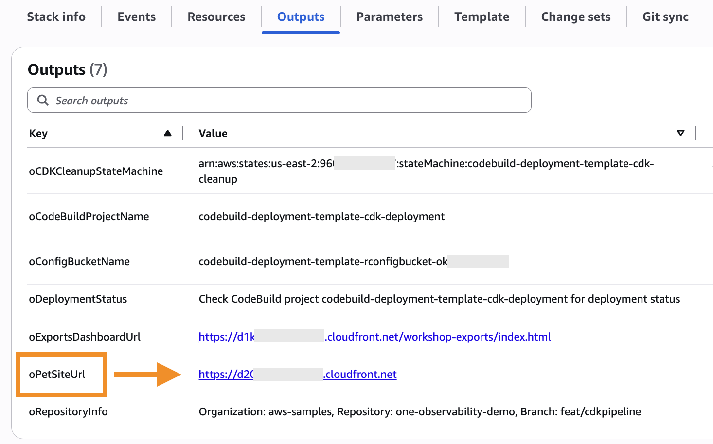
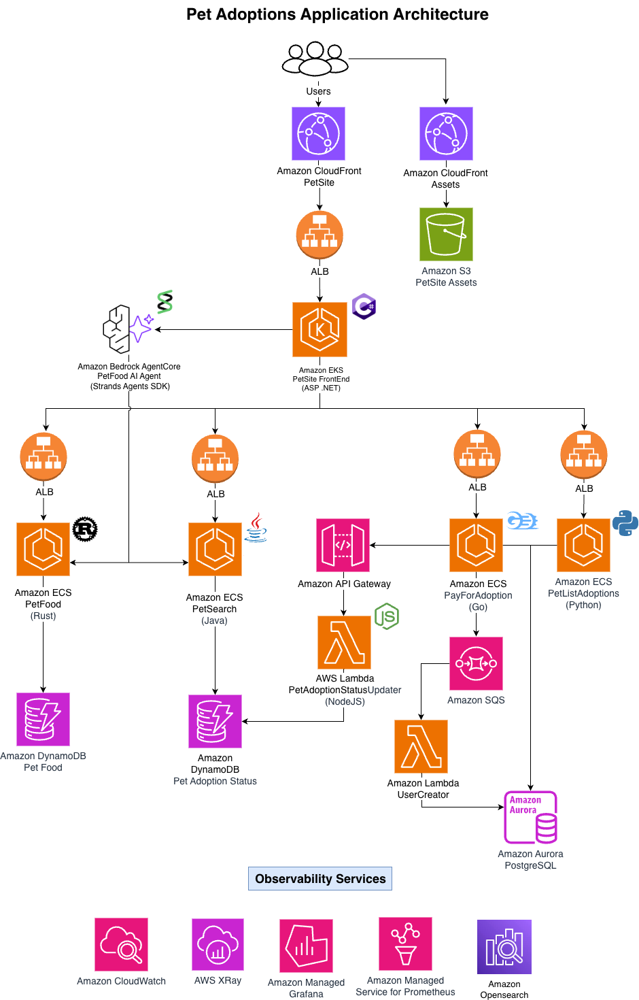

# Using the CloudFormation console

In the CloudFormation console do the following:

Select Stacks on the left-side navigation.
Find the stack named codebuild-deployment-template and click to open it.
Select the Outputs tab. Your individual pet adoption website URL will be the oPetSiteUrl, as seen in this image:

## Next steps

Navigate to the URL that was returned as a result. You should see the application home screen as shown below.

You can navigate through the application with several pet options.

## Troubleshooting

In very rare cases, you might encounter a behavior where the site does not show any pet images. Click on *Perform Housekeeping* in the application home page's upper right corner.

## APP ARQUITECTURE

