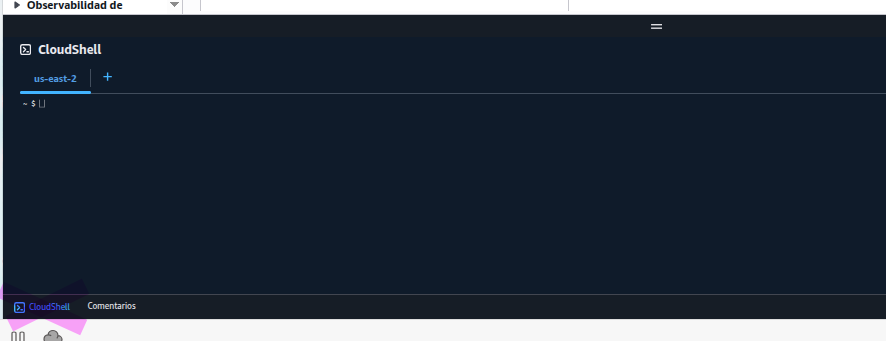
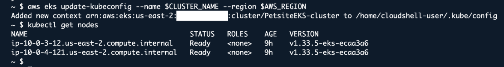

# Workshop pre-requisites

Some sections of the workshop will require you to run shell commands. For this, you will need access to a terminal environment. This section provides instructions to use AWS CloudShell, a browser-based shell where you can quickly run scripts with the AWS Command Line Interface (CLI) and other tools. If you're using Workshop Studio, the environment is pre-configured with all necessary tools and permissions. You only need to launch CloudShell as described below.

## Launching a CloudShell terminal

In the AWS console, open the CloudShell terminal by clicking on the icon on the bottom left as shown in the next image. It will take a few seconds to initialize and be ready to use.


Your CloudShell terminal can be maximized to a separate tab or minimized at any moment. After a few minutes of inactivity, CloudShell will shutdown but you can resume your activity by opening anew or refreshing your browser.

## Installing dependencies

Some instructions will require a few binaries not installed by default such as helm, awscurl and more. We will install these dependencies by running the following command:

```sh
curl -s https://raw.githubusercontent.com/aws-samples/one-observability-demo/main/setup-cloudshell.sh | sh
```

## Setting up EKS access

These commands configure access to the EKS cluster using EKS access entries. First, we'll get your current IAM role and add it to the cluster with full permissions.

```sh
# Set cluster name
CLUSTER_NAME=PetsiteEKS-cluster

# Get your current IAM role ARN
ROLE_ARN=$(aws sts get-caller-identity --query Arn --output text | sed 's/:sts:/:iam:/' | sed 's/:assumed-role\//:role\//' | sed 's/\/[^/]*$//')

# Check if access entry already exists
if aws eks list-access-entries --cluster-name $CLUSTER_NAME --query "accessEntries[?contains(@, '$ROLE_ARN')]" --output text | grep -q "$ROLE_ARN"; then
  echo "Access entry already exists for $ROLE_ARN"
else
  # Add your role as an access entry with cluster admin permissions
  aws eks create-access-entry \
    --cluster-name $CLUSTER_NAME \
    --principal-arn $ROLE_ARN \
    --type STANDARD
  echo "Access entry created for $ROLE_ARN"

  # Associate the cluster admin policy (idempotent operation)
  aws eks associate-access-policy \
    --cluster-name $CLUSTER_NAME \
    --principal-arn $ROLE_ARN \
    --policy-arn arn:aws:eks::aws:cluster-access-policy/AmazonEKSClusterAdminPolicy \
    --access-scope type=cluster
fi
```

## Update kubeconfig to interact with the cluster

```sh
aws eks update-kubeconfig --name $CLUSTER_NAME --region $AWS_REGION
kubectl get nodes
```

Your output should look like the following:



## Source code

The complete source code and deployment instructions are available on the [One Observability Demo GitHub repository](https://github.com/aws-samples/one-observability-demo).
