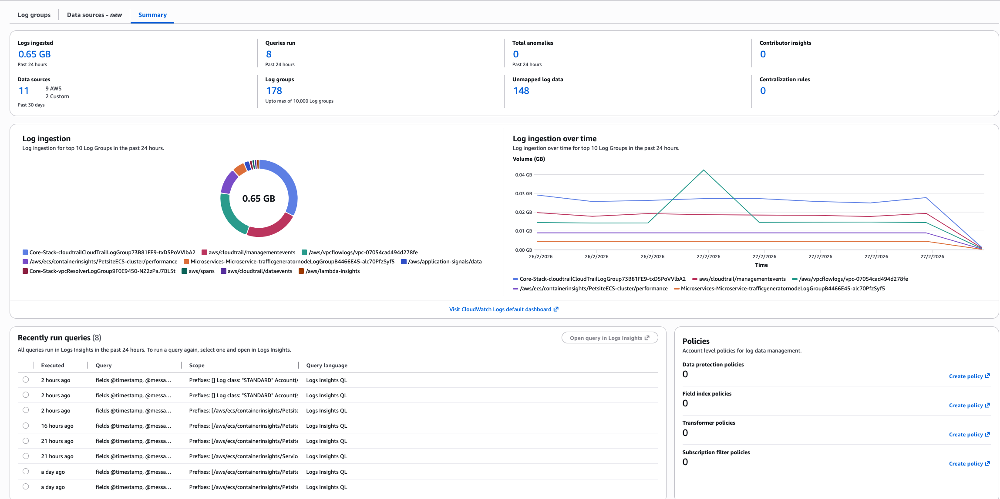

# Logs and Log Management

## LOGS

**Amazon CloudWatch Logs** enables you to centralize logs from all your systems, applications, and AWS services in a single, highly scalable service. You can view, search, filter, and archive logs for future analysis.

### Key Capabilities

| Capability | Description |
| --- | --- |
| Centralized Collection | Aggregate logs from EC2, Lambda, ECS, CloudTrail, and custom applications |
| Real-time Search | Search for specific error codes, patterns, or fields |
| Query & Analysis | Use CloudWatch Logs Insights for powerful log analytics |
| Visualization | Create dashboards to visualize log data |
| Alerting | Set up metric filters and alarms based on log patterns |

### What You'll Learn

This module covers the following topics:

| Section | Description |
| --- | --- |
| Log Management | Create and manage log groups, explore log classes |
| Logs Insights | Query and analyze logs using CloudWatch Logs Insights |
| Log Anomaly Detection | Use ML to detect anomalies and patterns |
| Data Protection | Detect and mask sensitive data in logs |
| Metric Filters | Create CloudWatch metrics from log data |
| Subscription Filters | Stream logs to other AWS services |
| Integrations | Connect with OpenSearch and S3 Tables |

## Log Management

[Amazon CloudWatch Logs](https://docs.aws.amazon.com/AmazonCloudWatch/latest/logs/WhatIsCloudWatchLogs.html) enables you to collect, store, and analyze log data from your AWS resources, applications, and services.

### Learning objectives

In this section you will:

- Navigate the **CloudWatch Logs** Summary Dashboard to monitor ingestion and spot trends
- Create **Standard** and **Infrequent Access** log groups and understand when to use each
- Explore the hierarchical structure of log groups, log streams, and log events

### Exploring the Log Management Summary Dashboard

The **Log Management → Summary** tab gives you a single-pane view of log ingestion volume, active data sources, log group counts, and recent query activity.

1) In the AWS Management Console, open **CloudWatch**
2) In the left navigation under **Logs**, click **Log Management** — the **Summary** tab is shown by default

*The dashboard surfaces several key metrics:*

- **Logs Ingested (Past 24 Hours)** —> total volume received. Watch for unexpected spikes that could signal misconfigurations or runaway logging.
- **Data Sources** —> number of unique sources sending logs to CloudWatch. Helps you track which services and applications are actively logging.
- **Log Groups** —> total count of log groups in your account. Useful for assessing organization and spotting consolidation opportunities.
- **Queries Run** —> number of CloudWatch Logs Insights queries executed. High counts may indicate active troubleshooting or a need for automated alerting.
- **Anomalies Detected** —> unusual patterns flagged by CloudWatch anomaly detection. Investigate early, before users notice.
- **Contributor Insights Rules** —> active rules analyzing log data to identify top contributors to system behavior.
- **Unmapped Log Data** —> log data that hasn't been categorized yet. Worth reviewing to keep your log organization clean.

The *donut* chart shows which log groups consume the most ingestion capacity — useful for identifying candidates to move to **Infrequent Access**. The line graph shows 24-hour ingestion trends so you can spot spikes or unexpected quiet periods.
