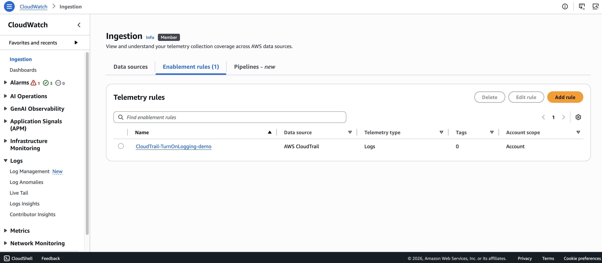
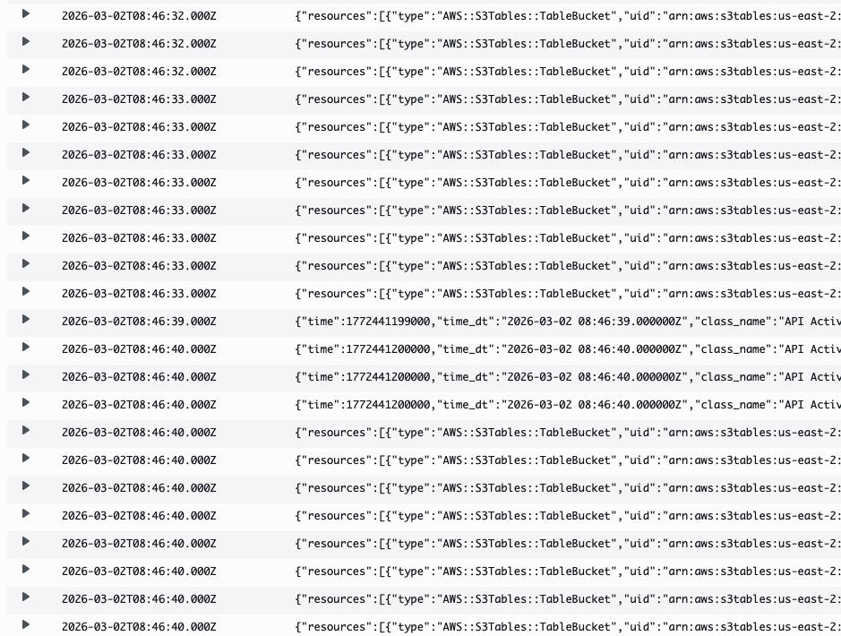
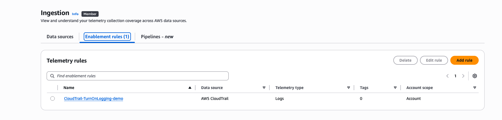
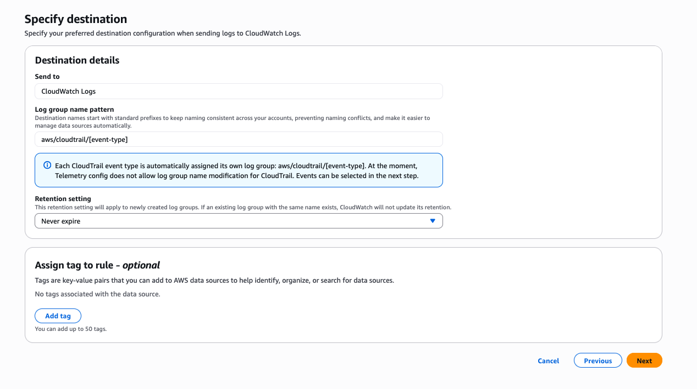
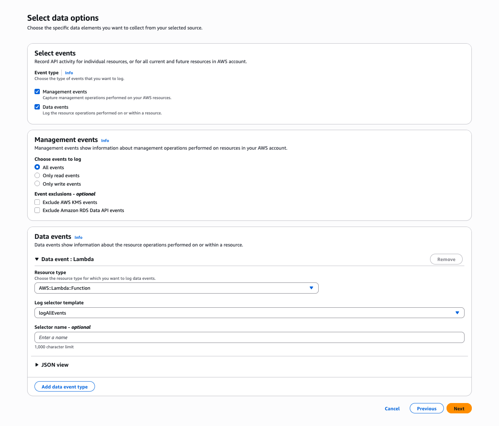

# Ingestion - enablement rules

Telemetry enablement rules automate log collection from AWS services such as **Amazon VPC, AWS CloudTrail, Network Load Balancer, Route 53**, and other supported services across your *AWS Organization* or individual accounts. Rules help you standardize telemetry collection across your organization or accounts and ensure consistent monitoring coverage.

## Understanding enablement rules

**CloudWatch** telemetry configuration integrates with **AWS Config** to discover and manage resources:

- When you create an enablement rule, CloudWatch creates a corresponding **AWS Config** recorder
- The recorder discovers resources that match your rule criteria
- **CloudWatch** applies telemetry configuration to non-compliant resources (those without telemetry enabled)
- **AWS Config** tracks configuration changes over time

*CloudWatch uses AWS Config internal service-linked recorders. You are not charged for configuration items (CIs) that CloudWatch uses as part of these internal recorders. Initial resource discovery may take up to 24 hours to complete in some cases.*

## Rule behavior patterns

| Scenario | Behavior |
| --- | --- |
| **New resources** | Enablement rules automatically apply to newly created resources that match the rule criteria |
| **Existing VPC Flow Logs** | **CloudWatch** creates new flow logs only for resources without existing flow logs |
| **Existing CloudWatch Logs** | Existing log groups are maintained if they match the resource pattern |
| **Updating rules** | Only new resources adopt the updated configuration; existing telemetry settings remain unchanged |
| **Non-compliant resources** | If telemetry is manually deleted, the rule reapplies when compliance is restored |

## Rule components

***An enablement rule consists of:***

| **Component** | **Description** |
| --- | --- |
| **Rule scope** | Organization, organizational unit (OU), or account |
| **Resource types** | The AWS services the rule applies to (**VPC, EKS, CloudTrail, WAF**, etc.) |
| **Telemetry types** | Logs, metrics, or traces |
| **Optional filters** | Tags to target specific resources |

## Create enablement rules

In this section, you'll create an enablement rule for the **CloudTrail** data source. **CloudTrail** collects API activity data across your AWS environment, including management and data events. These logs provide visibility into account activity and resource changes for security analysis, compliance auditing, and operational troubleshooting.

### Prerequisites

For the purpose of demo, ensure you have a **CloudTrail** trail configured with the following settings:

- Management events: All management events logging enabled
- Data events: Enabled for Lambda resource

*Note: A demo CloudTrail trail with required configuration is pre-created for this workshop. If you're following along in your own account, see [Create a trail to log management events](https://docs.aws.amazon.com/awscloudtrail/latest/userguide/tutorial-trail.html) for setup guidance.*

### Step-by-step instructions

1) Go to the [CloudWatch Console](https://console.aws.amazon.com/cloudwatch/).
2) In the navigation pane, choose **Ingestion** and select **Enablement rules**.
3) Click Add rule and provide the following details:

- Specify scope: -> Select **AWS CloudTrail** as data source and click **Configure telemetry** - Rule name: *CloudTrail-TurnOnLogging-demo* - Click **Next**
- Specify destination: -> Leave default options and click *Next*
- Select data options: -> Event type: Select Management events -> Management events: Select All events -> Click **Next**

4) Review the details and click **Configure CloudTrail enablement**.

After the telemetry rule is configured, a log group will be created with the name *aws/cloudtrail/managementevents* as per the configuration defined in the telemetry enablement rule.

### Inspect CloudTrail management events

1) Go to the [CloudWatch Console](https://console.aws.amazon.com/cloudwatch/).
2) In the navigation pane, choose **Logs** → **Log Management**.
3) Filter and select the log group *aws/cloudtrail/managementevents*.
4) Inspect the management events logging in that log group.

## Manage enablement rules

### Viewing rules

1) Go to the [CloudWatch Console](https://console.aws.amazon.com/cloudwatch/).
2) In the navigation pane, choose **Ingestion** and select **Enablement rules**.
3) View all rules with details such as Data source, Telemetry type, and scope.

### Editing rules

1) Go to the [CloudWatch Console](https://console.aws.amazon.com/cloudwatch/).
2) In the navigation pane, choose **Ingestion** and select **Enablement rules**.
3) Select the rule *CloudTrail-TurnOnLogging-demo* and click **Edit rule**.
4) Skip to **Next** step (Telemetry config does not allow log group name modification for **CloudTrail**).

5) For **Select data options**, choose **Data events***:

- Resource type: Select *AWS::Lambda::Functio*n
- Log selector template: *logAllEvents*
- Click **Next**

6) Review the details and click **Update rule**.

Since we have enabled data events, a new log group will be created with the name *aws/cloudtrail/dataevents* with data events related to **AWS Lambda** service.

*WARNING: Ensure you have enabled data event logging for any existing or new CloudTrail trail.*

### Deleting rules

1) Go to the [CloudWatch Console](https://console.aws.amazon.com/cloudwatch/).
2) In the navigation pane, choose **Ingestion** and select **Enablement** rules.
3) Select the rule you want to delete and click **Delete**.

*WARNING: Deleting a rule does not remove telemetry configurations already applied to resources. It only prevents the rule from applying to new resources.*

## Summary

In this module, you learned how to automate log collection using CloudWatch telemetry enablement rules. You created an enablement rule for CloudTrail to collect management events, verified the log group creation, and edited the rule to add data events for Lambda functions.

Enablement rules help you maintain consistent monitoring coverage across your AWS environment by automatically collecting telemetry data as resources are created.

## Additional resources

[Working with telemetry enablement rules](https://docs.aws.amazon.com/AmazonCloudWatch/latest/monitoring/telemetry-config-rules.html)
