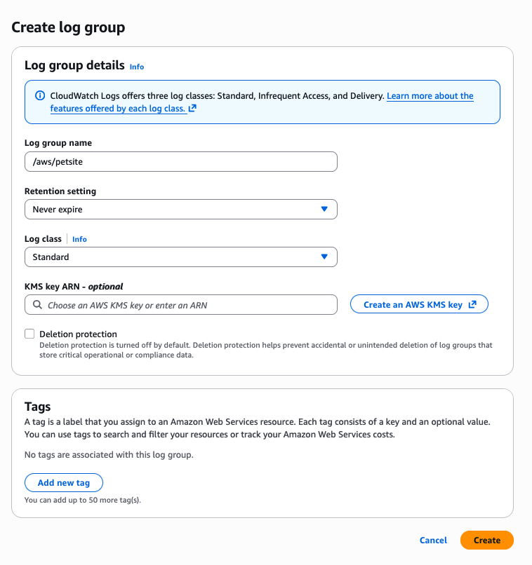
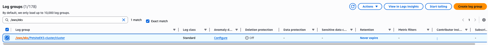
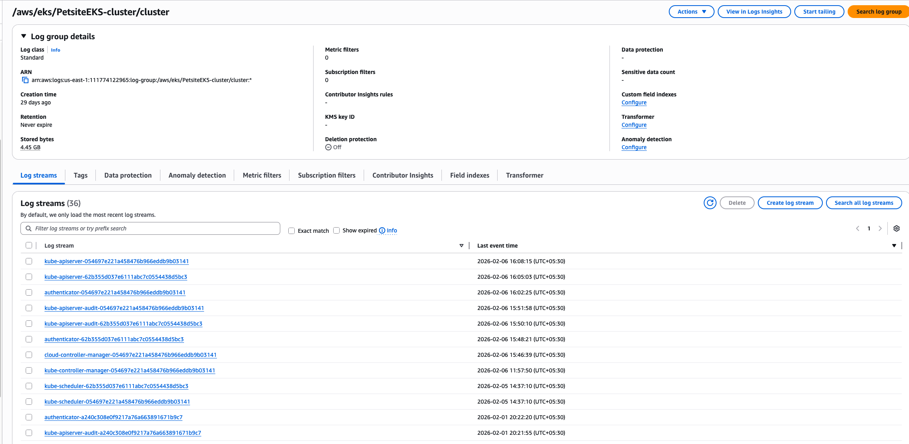
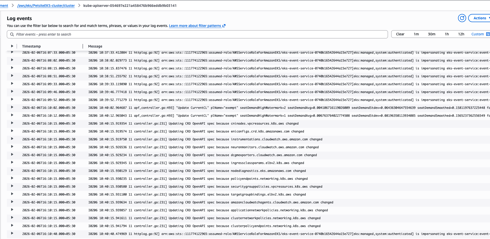

# CloudWatch Logs and log groups

Amazon CloudWatch Logs is a centralized logging service that helps you monitor, store, and access log files from various sources including Amazon EC2 instances, AWS Lambda functions, Amazon ECS containers, AWS CloudTrail events, and custom applications and on-premises servers.

## Key terminology

Understanding the hierarchical structure of CloudWatch Logs is essential for effective log management:

- Log Event -> A single record of activity, consisting of a timestamp and a raw message. This is the most granular unit in CloudWatch Logs.
- Log Stream -> A sequence of log events that share the same source. For example, all log events from a specific EC2 instance or a single Lambda function execution create a log stream.
- Log Group -> A container that organizes multiple log streams sharing common characteristics such as retention settings, monitoring configuration, access control policies, and encryption settings.

## Relationship Hierarcy

- Log Group (e.g., /aws/lambda/my-application)
  - Log Stream 1 (e.g., 2026/02/18/abc123)
    - Log Event 1
    - Log Event 2
    - Log Event 3
  - Log Stream 2 (e.g., 2026/02/18/def456)
    - Log Event 1
    - Log Event 2

## CloudWatch Logs key features

Log classes for cost optimization

- Standard -> For frequently accessed logs requiring full feature support
- Infrequent Access (IA) -> For logs accessed infrequently, offering reduced ingestion costs

## Core capabilities

- Query your log data –> Use CloudWatch Logs Insights to interactively search and analyze your log data for efficient incident response.
- Create field indexes –> Index fields in your log events to reduce scan volume and return query results faster.
- Live Tail –> Quickly troubleshoot incidents by viewing a streaming list of new log events as they are ingested.
- Monitor EC2 instances –> Use CloudWatch Logs to monitor applications and systems using log data.
- CloudTrail integration –> Create alarms and receive notifications for API activity captured by CloudTrail.
- Data protection –> Audit and mask sensitive data using data protection policies.
- Log retention –> Adjust retention policy per log group, from 1 day to 10 years, or keep indefinitely.
- Deletion protection –> Prevent accidental deletion of log groups and their log streams.
- Archive log data –> Store your log data in highly durable storage.
- Route 53 DNS queries –> Log information about DNS queries that Route 53 receives.

## Create a standard log group

Standard log groups are designed for logs that you access frequently and require full CloudWatch Logs feature support. These are ideal for active applications, real-time monitoring, and operational troubleshooting.

### When to use standard log groups

- Production application logs requiring real-time monitoring
- Logs that feed into active alarms and dashboards
- Data requiring frequent querying and analysis
- Logs used for operational troubleshooting and debugging
- Sources where you need all CloudWatch Logs features

### Step-by-step instructions

1) Open the [CloudWatch console](https://console.aws.amazon.com/cloudwatch/).

2) In the navigation pane, choose Log Management → Log groups.

3) Click **Create log group** and enter a name (e.g., */aws/petsite*).

4) Optionally select an **AWS KMS key** for encryption at rest, or leave as default for AWS-managed encryption.

5) Add **Tags** (optional but recommended) to organize and track costs.
Review your configuration and click **Create**.

***WARNING: After a log group is created, its log class cannot be changed.***

### Send logs to a log group

**CloudWatch Logs** automatically receives log events from several AWS services. You can also send log events using the following methods:

| Method | Description |
| --- | --- |
| CloudWatch agent | The unified CloudWatch agent can send both metrics and logs to CloudWatch Logs. See Collecting Metrics and Logs  in the CloudWatch User Guide. |
| AWS CLI | Use put-log-events to upload batches of log events to CloudWatch Logs. |
| Programmatically | Use the PutLogEvents API to programmatically upload batches of log events. |

## View log data

You can view and scroll through log data on a stream-by-stream basis. You can also specify the time range for the log data to view.

1) Open the [CloudWatch console](https://console.aws.amazon.com/cloudwatch/).

2) In the navigation pane, choose **Log Management**.

3) Navigate to the **Log groups** tab and choose the log group to view the streams. In this example, we are choosing */aws/eks/PetsiteEKS-cluster/cluster*

4) In the list of log streams, choose the name of the log stream that you want to view.

5) Click on a log stream to see the log data for that particular stream.

