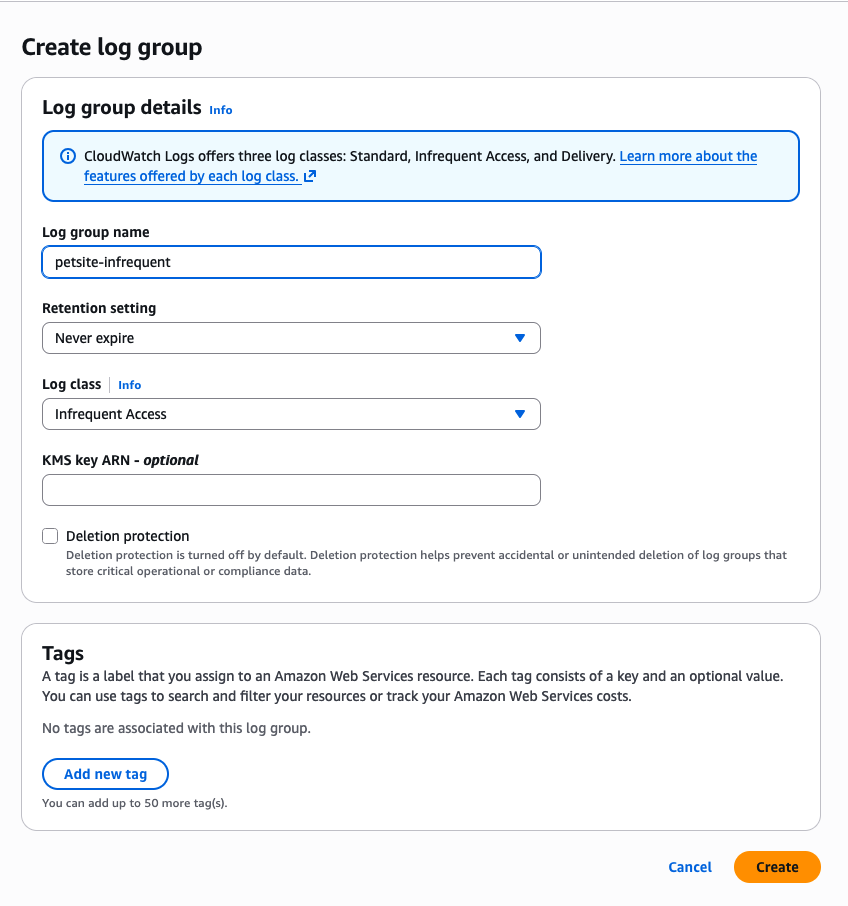

# Logs Infrequent Access

Amazon CloudWatch Logs Infrequent Access (Logs IA) is a log class for cost-effectively consolidating all your logs natively on AWS, helping to improve visibility into your overall application health. CloudWatch Logs IA offers a subset of CloudWatch Logs capabilities including managed ingestion, storage, cross-account log analytics, and encryption with a lower per GB ingestion price.

Logs IA is ideal for ad-hoc querying and after-the-fact forensic analysis on infrequently accessed logs. By consolidating your logs natively in CloudWatch, you can eliminate the operational overhead of managing multiple solutions and reduce your Mean Time to Resolution (MTTR) by analyzing all your logs in one place.

Check the [list of features](https://docs.aws.amazon.com/AmazonCloudWatch/latest/logs/CloudWatch_Logs_Log_Classes.html#Log_Class_Features) CloudWatch Logs Standard class and Infrequent Access class log groups support.

## Cost Structure Comparison

*WARNING: Pricing disclaimer: Pricing varies by region and may change over time. Always check the [official CloudWatch pricing page](https://aws.amazon.com/cloudwatch/pricing/) for current rates in your region.*

| **Cost Component** | **Infrequent Access vs Standard** |
| --- | --- |
| **Data Ingestion** | ~50% lower |
| **Data Storage** | Same |
| **Data Scanning (queries)** | Same |
| **Data Transfer** | Same |

**INFO: When to use Logs IA:** *You save money on ingestion (when logs are written) but pay the same for storage and queries. This makes Logs IA ideal for "write once, read rarely" scenarios.*

## Creating a Logs IA Log Group

To explore Logs IA, we will create a CloudWatch Log Group with Infrequent Access as the log class.

1) In the AWS Management Console, navigate to **CloudWatch**.
2) Under **Logs**, select **Log Groups** and click **Create Log Group**.
3) Provide a name for the log group (for example *petsite-infrequent*), leave the default **Retention setting** as *Never expire*, select **Infrequent Access** as the **Log class**, and click **Create**.

**WARNING: Log class cannot be changed!** *Once a log group is created in CloudWatch, its log class cannot be modified.*

## Logs IA Use Cases

| **Use Case** | **Description** |
| --- | --- |
| **New Workloads** | Recommended for workloads that don't require advanced features provided by the Standard log class. |
| **Compliance & Regulatory** | Financial institutions can aggregate log data critical for compliance purposes or regulatory obligations that don't require frequent access. Ideal for compliance audits, regulatory checks, or legal investigations. |
| **Non-Production Environments** | Software development and IT applications generate logs for debugging and troubleshooting that are accessed occasionally. Cost-effective for dev/test environments. |
| **Security & Forensics** | IDS logs, firewall alerts, VPC flow logs, access logs (S3, ELB, CloudFront, API Gateway, web servers, RDS), debug logs, and IoT fleet logs needed only for post-event investigations or forensic analysis. |

## Additional References

- [AWS Blog: New Amazon CloudWatch log class for infrequent access logs at a reduced price](https://aws.amazon.com/blogs/aws/new-amazon-cloudwatch-log-class-for-infrequent-access-logs-at-a-reduced-price/)
- [Youtube: Leverage Amazon CloudWatch Logs Infrequent Access](https://www.youtube.com/watch?v=eQRKcLifJ-s)
- [Amazon CloudWatch Logs User Guide](https://docs.aws.amazon.com/AmazonCloudWatch/latest/logs/CloudWatch_Logs_Log_Classes.html)
