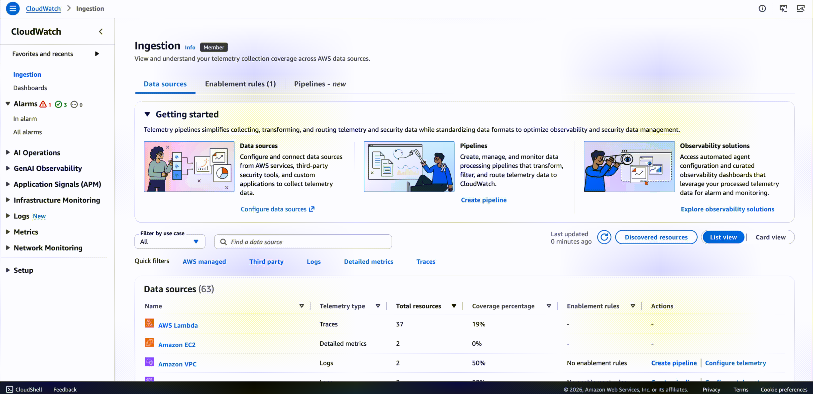
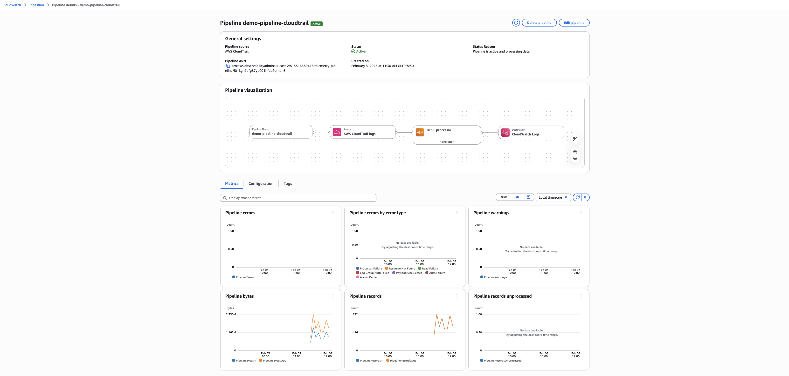

# Ingestion - Telemetry pipelines

**CloudWatch pipelines** provide a centralized way to collect data from AWS services, third-party applications, and custom sources, process and transform data using a rich set of processors, convert data into standard formats like Open Cybersecurity Schema Framework (OCSF), and route processed data to destinations like **CloudWatch Logs**.

## Key capabilities

- **Multiple data sources:** Ingest data from CloudWatch Logs, S3 buckets, and third-party services
- **Rich processing:** Transform, parse, and enrich log data
- **Format standardization:** Convert varied log formats into OCSF for unified security analysis
- **Secure data handling:** All data remains encrypted in transit with TLS
- **Monitoring and observability:** Track pipeline health and performance with CloudWatch metrics

*WARNING: CloudWatch pipeline capabilities are offered as part of existing CloudWatch Logs Data ingestion pricing at no additional cost, with metering occurring at time of ingestion.*

For more information, refer to [CloudWatch Pipelines](https://docs.aws.amazon.com/AmazonCloudWatch/latest/logs/CloudWatch-Logs-Transformation.html)

## Understanding pipeline components

Each pipeline consists of three main components:

| **Component** | **Description** |
| --- | --- |
| **Source** | Defines where your data comes from (AWS services, third-party applications, or custom sources) |
| **Processors (Optional)** | Transform, parse, and enrich log data as it flows through the pipeline |
| **Sink** | Specifies where your processed data should be delivered |

### Sink behavior

| **Source Type** | **Destination** |
| --- | --- |
| **CloudWatch Logs sources** | Events are sent back to their original log group using @original |
| **S3 and third-party sources** | Events are sent to a specified log group |

## Setup pipeline for CloudTrail logs

In this section, you will create a pipeline that intercepts **CloudTrail** logs from **CloudWatch Logs**, transforms them into *OCSF* format, and sends them back to the original log group. This standardization enables unified security analysis across different log sources.

### Prerequisites

Ensure you have **CloudTrail** logs enabled and sending to **CloudWatch Logs**. If you completed the Enablement Rules module, you should already have **CloudTrail** configured with log groups like *aws/cloudtrail/managementevents* or *aws/cloudtrail/dataevents*.

## Create pipeline

1) Go to the [CloudWatch Console](https://console.aws.amazon.com/cloudwatch/).

2) In the navigation pane, choose **Ingestion** and select **Pipelines**.

3) Click **Create pipeline** with the following details:

| **Step** | **Configuration** |
| --- | --- |
| **Data source** | Select *AWS CloudTrail* logs from drop-down |
| **Pipeline name** | Enter *demo-pipeline-cloudtrail*, click **Next** |
| **Configuration details** | Select *Management* in Log source type drop-down |
| **Service access** | Choose *Auto create and use a new service role*, click **Next** |
| **Configure destination** | Leave default, click **Next** |
| **Configure processors** | Choose *OCSF* processor from drop-down, click **Add** |
| **OCSF versions** | Select latest versions for both OCSF schema and Mapping version, click **Next** |

4) Review the details and click **Create pipeline**.

The pipeline will start processing logs within a few minutes. New **CloudTrail** management events flowing into the *aws/cloudtrail/managementevents* log group will be automatically intercepted, transformed into OCSF format, and written back to the original log group. Pipeline creation takes up to 5 minutes depending on the source type.

## Manage pipelines

After creating pipelines, you can monitor their performance and manage their configuration through the **Pipelines** tab.

### Check pipeline status

1) Go to the [CloudWatch Console](https://console.aws.amazon.com/cloudwatch/).

2) In the navigation pane, choose **Ingestion** and select **Pipelines**.

3) Locate the pipeline *demo-pipeline-cloudtrail*.

4) Verify the **Processing status** and **Data throughput metrics**.



## Review pipeline details

Review comprehensive pipeline details including general settings, visualization, metrics, and configuration.

1) Go to the [CloudWatch Console](https://console.aws.amazon.com/cloudwatch/).

2) In the navigation pane, choose **Ingestion** and select **Pipelines**.

3) Click on the pipeline *demo-pipeline-cloudtrail*.



The pipeline details page displays the following information:

| **Tab** | **Description** |
| --- | --- |
| **General Settings** | View key pipeline information including pipeline name, status, status reason, creation date |
| **Visualization** | Shows the data flow through your pipeline from source to destination |
| **Metrics** | Displays pipeline performance data to monitor health, performance, and data flow patterns |
| **Configuration** | Shows your pipeline definition in YAML or JSON format |
| **Tags** | View and manage tags associated with your pipeline for resource organization |

## Inspect transformed logs

Based on the configuration above, the pipeline is now actively processing **CloudTrail** logs and transforming them into *OCSF* format. With the pipeline metrics showing active data flow, you can now inspect the transformed logs in the destination log group.

## View transformed logs

1) Go to the [CloudWatch Console](https://console.aws.amazon.com/cloudwatch/).

2) In the navigation pane, choose **Logs → Log Management**.

3) Filter and open the log group *aws/cloudtrail/managementevents*.

4) Click **Search all log streams**.

5) Adjust the time range to display recent events (e.g., last 5, 10, or 15 minutes).

6) Examine the log events:
    - For OCSF-transformed logs, you should see structured JSON with OCSF fields
    - Look for fields like *class_name, category_name, severity, time, api, actor*, etc.

***Example OCSF-transformed CloudTrail log***

```sh
{
    "resources": [
        {
            "uid": "arn:aws:ssm:us-east-2:123456789012:parameter/petstore/petsiteurl",
            "owner": {
                "account": {
                    "uid": "123456789012"
                }
            }
        }
    ],
    "time": 1640000000000,
    "time_dt": "2021-12-20 13:33:20.000000Z",
    "class_name": "API Activity",
    "class_uid": 6003,
    "category_name": "Application Activity",
    "category_uid": 6,
    "cloud": {
        "provider": "AWS",
        "region": "us-east-2",
        "account": {
            "uid": "123456789012"
        }
    },
    "severity_id": 1,
    "severity": "Informational",
    "api": {
        "request": {
            "data": "{\"name\":\"/petstore/petsiteurl\",\"withDecryption\":false}",
            "uid": "11111111-2222-3333-4444-555555555555"
        },
        "operation": "GetParameter",
        "service": {
            "name": "ssm.amazonaws.com"
        }
    },
    "actor": {
        "user": {
            "type": "AssumedRole",
            "uid": "arn:aws:sts::123456789012:assumed-role/ExampleRole/session-name"
        }
    },
    "status": "Success",
    "activity_name": "Read",
    "type_name": "API Activity: Read"
}
```

The original **CloudTrail** JSON format uses AWS-specific field names like *eventName*, *userIdentity*, and *awsRegion*. After OCSF transformation, these are mapped to standardized fields such as *api.operation, actor.user, and cloud.region*, enabling unified security analysis across different log sources and vendors.

## Monitor pipeline health

**CloudWatch** pipelines publish metrics to **Amazon CloudWatch** in the *AWS/Observability Admin* namespace. Use these metrics to monitor your pipelines' health, performance, and data flow.

### View pipeline metrics

1) Go to the [CloudWatch Console](https://console.aws.amazon.com/cloudwatch/).

2) In the navigation pane, choose **Metrics → All metrics**.

3) Select the **Observability Admin** namespace under AWS namespaces.

4) Choose **PipelineName** dimension and select the *pipeline demo-pipeline-cloudtrail*.

5) View available metrics.

For more information, see [Monitoring Pipelines Using CloudWatch Metrics](https://docs.aws.amazon.com/AmazonCloudWatch/latest/logs/CloudWatch-Logs-Monitoring-Pipelines.html).

## Create alarms

You can create **CloudWatch** alarms based on any of the pipeline metrics. For example, create an alarm that monitors *PipelineErrors* and *PipelineWarnings* to detect and identify potential issues with the pipeline configuration.

For more information, see [Create a CloudWatch alarm based on a static threshold](https://docs.aws.amazon.com/AmazonCloudWatch/latest/monitoring/ConsoleAlarms.html)

## Delete a pipeline

1) Go to the [CloudWatch Console](https://console.aws.amazon.com/cloudwatch/).

2) In the navigation pane, choose **Ingestion** and select **Pipelines**.

3) Click on the pipeline *demo-pipeline-cloudtrail*.

4) Click **Delete** and confirm deletion.

*WARNING: Deleting a pipeline does not delete the logs that were already processed. It only stops future log processing.*

## Best practices

| **Practice** | **Recommendation** |
| --- | --- |
| **Monitor Data Flow** | Track *PipelineBytesIn*, *PipelineBytesOut*, *PipelineRecordsIn*, and *PipelineRecordsOut* metrics. Watch for unexpected changes in throughput patterns. |
| **Track Errors and Warnings** | Create alarms for *PipelineErrors* to detect issues quickly. Use *PipelineErrorsByErrorType* to diagnose specific problems. Monitor *PipelineWarnings* to catch potential issues early. |
| **Configure Appropriate Thresholds** | Set alarm thresholds based on expected data patterns. Account for normal variations and peak usage periods to avoid false positives. |
| **Pipeline Design** | Start simple and add complexity as needed. Test processors with sample data before deploying. Use only necessary processors to minimize latency. |

## Summary

In this module, you learned how to use **CloudWatch** Pipelines to collect, transform, and route log data. You created a pipeline for **CloudTrail** logs, configured processors to transform data into OCSF format, monitored pipeline health using **CloudWatch** metrics, and reviewed transformed logs.

### Additional resources

[CloudWatch Pipelines](https://docs.aws.amazon.com/AmazonCloudWatch/latest/monitoring/cloudwatch-pipelines.html)
