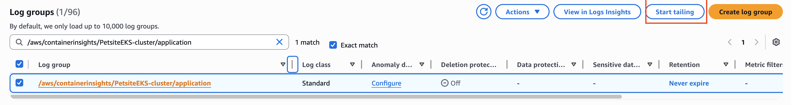
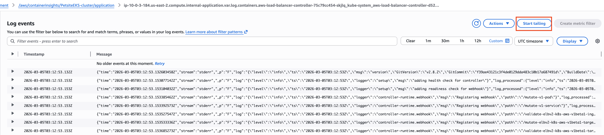
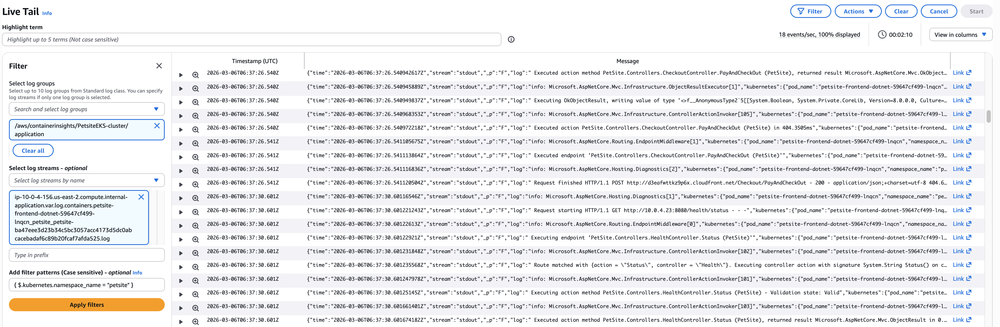
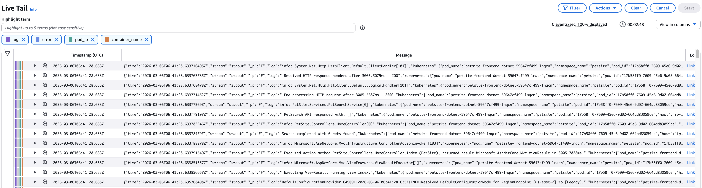
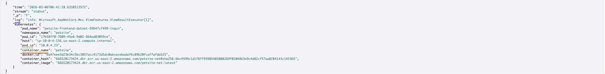
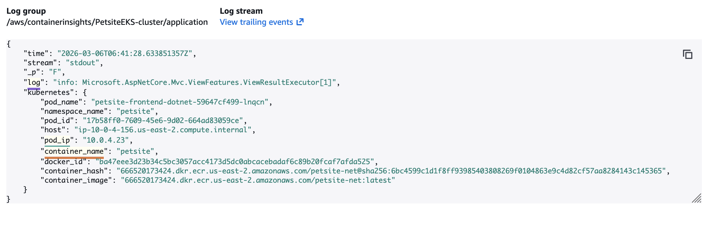

# Live Tail

Live Tail enables you to view a real-time streaming feed of log events as they are ingested into **CloudWatch Logs**. This is useful for quickly troubleshooting incidents by observing log data in near real-time without waiting for log queries to complete.

## Key Features

| **Feature** | **Description** |
| --- | --- |
| **Real-time streaming** | View log events as they arrive, with minimal latency |
| **Filtering** | Apply filter patterns to focus on specific events |
| **Keyword highlighting** | Highlight up to 5 terms to quickly identify relevant events |
| **Sampling** | Automatic sampling when event volume exceeds display capacity |

## Start a Live Tail session

You can access Live Tail directly from the CloudWatch console menu under the Logs section, or start a session from a specific log group.

### Start from a Log Group

1) In the navigation pane, choose **Log Management** and navigate to the **Log groups** tab.

2) Select the checkbox for the log group */aws/containerinsights/PetsiteEKS-cluster/application*.

3) Click the **Start Tailing** button.

*To start a Live Tail session for a specific log stream, navigate to the log group, select a log stream from the Log streams tab, and click Start Tailing from the log events page.*

## Configure filters

When the Live Tail console starts, click the Filter icon to expand the filtering configuration panel.

### Filter Options

| **Option** | **Description** |
| --- | --- |
| **Log group** | Required. At least one log group must be selected. Pre-populated if started from a log group. |
| **Log streams** | Optional. Available only when a single log group is selected. Select by name or prefix. |
| **Filter patterns** | Optional. Case-sensitive patterns to filter based on message content. |

### Apply a Filter Pattern

For this workshop, apply a filter to retrieve only logs from the *petsite* container:

1) In the **Add filter patterns** field, enter the following pattern: *{ $.kubernetes.namespace_name = "petsite" }*
2) Click **Apply filters** to start the tailing session.

*Learn more about [filter pattern syntax](https://docs.aws.amazon.com/AmazonCloudWatch/latest/logs/FilterAndPatternSyntax.html#matching-terms-events)*

## Highlight keywords

You can enter up to 5 terms to highlight in the tail session. Terms are not case sensitive. Enter each of the following words followed by Enter:

*log* *error* *pod_ip* *container_name*

Once the filter is applied, color bars appear on the left side of each event line, identifying which keywords were found.
Expand an event with a color code to see the exact location of the keyword match.

Use the magnifier icon next to an event to open a detailed view where you can review and copy the content. The View trailing events link provides access to the specific source of the message.

Highlight terms differ from filter patterns. Filters narrow down which events are displayed, while highlighted terms help identify specific content within https://aws.uruguru.online/13-live_tail/the filtered results. For example, filter by severity *error* but highlight the specific error code *HTTP 504*.

## Sampling behavior

When event volume exceeds the display rate, Live Tail samples the events. The status indicator shows:

- **events/s** –> The number of events streamed to the console
- **% displayed** –> The percentage of filtered events shown

For example, *100 events/s, 60% displayed* indicates that 167 filtered events were available, but only 100 (the maximum rate) were streamed to the console. Dropped log events are discarded from the Live Tail display only. They continue to be processed and saved to **CloudWatch Logs**.

